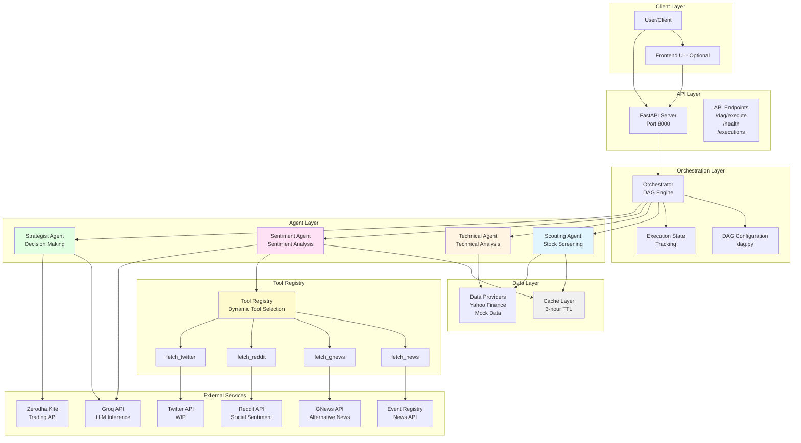
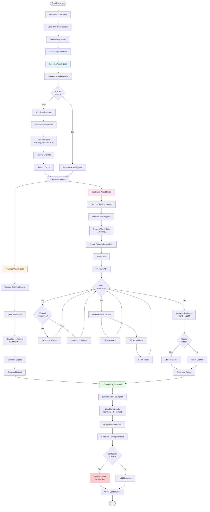
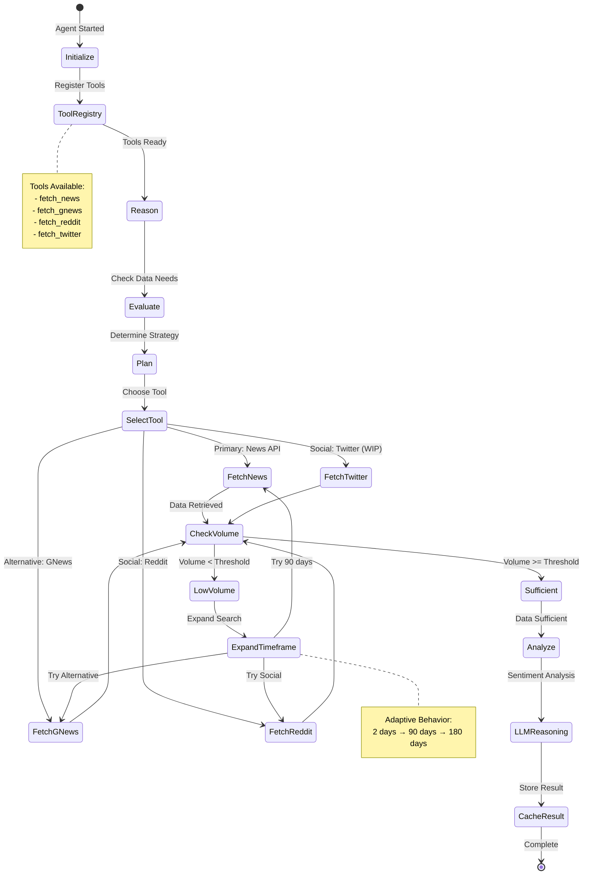
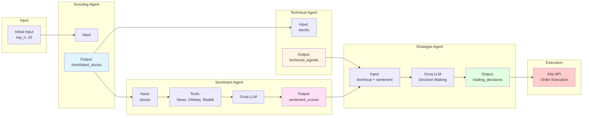
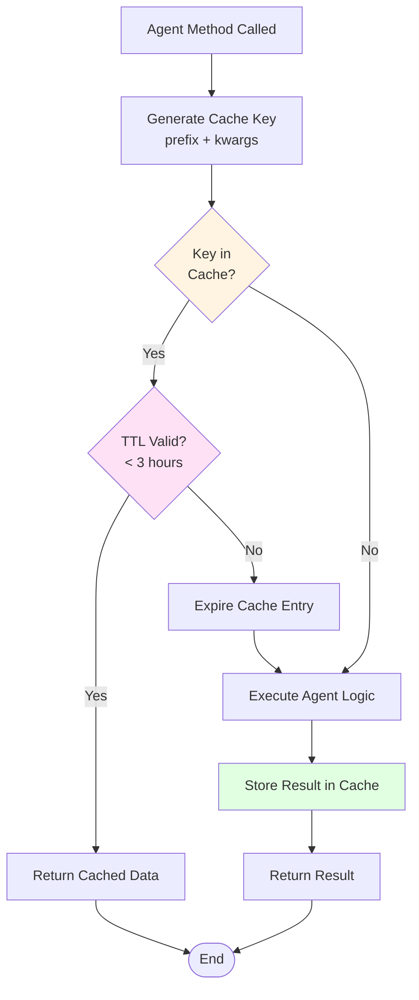
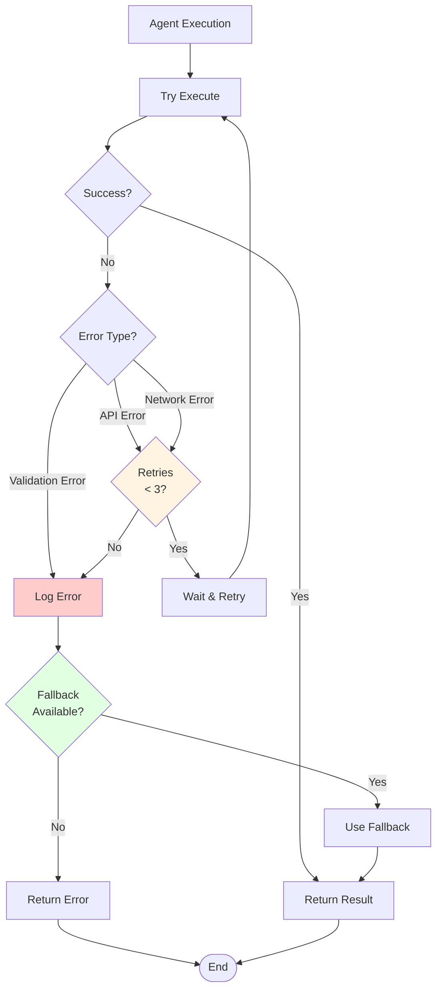
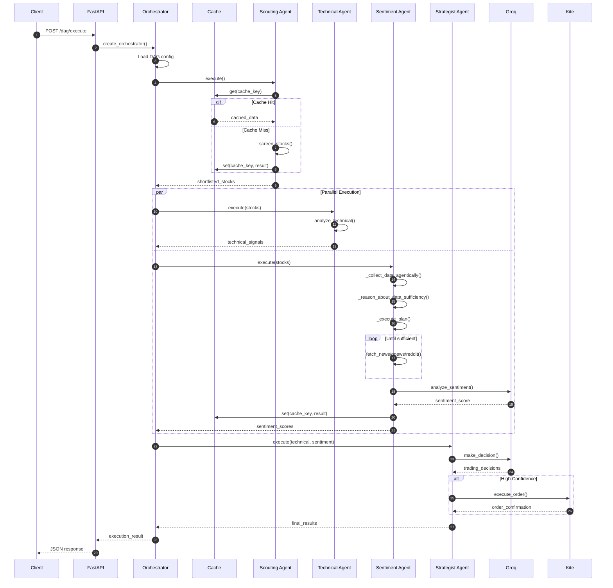
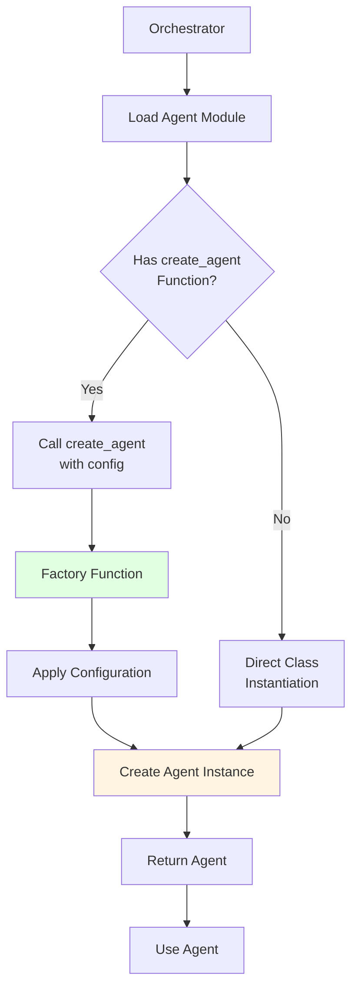

# Architecture & Flow Diagrams

This document provides detailed architecture diagrams and flow charts for the AI Swing Trader system.

## System Architecture Overview

## Detailed Agent Execution Flow

## Sentiment Agent Agentic Workflow

## Data Flow Diagram

## Caching Strategy

## Error Handling & Retry Logic

## Component Interaction Sequence

## Agent Factory Pattern

---

**Note**: These diagrams are best viewed in a Markdown viewer that supports Mermaid (e.g., GitHub, GitLab, VS Code with Mermaid extension, or online Mermaid editors).
