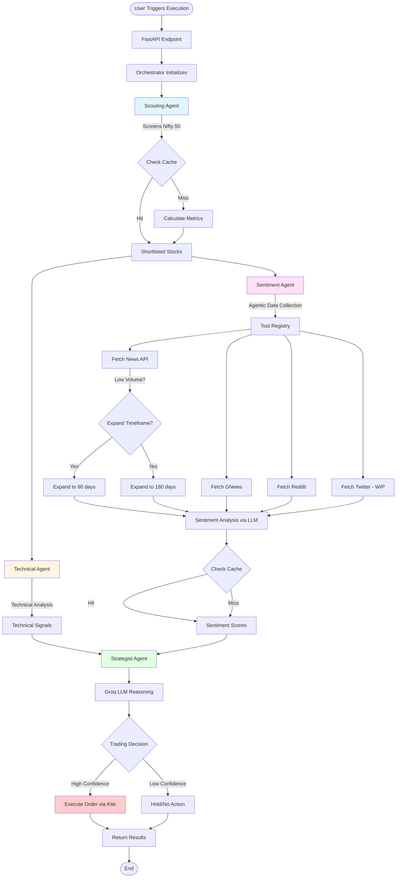
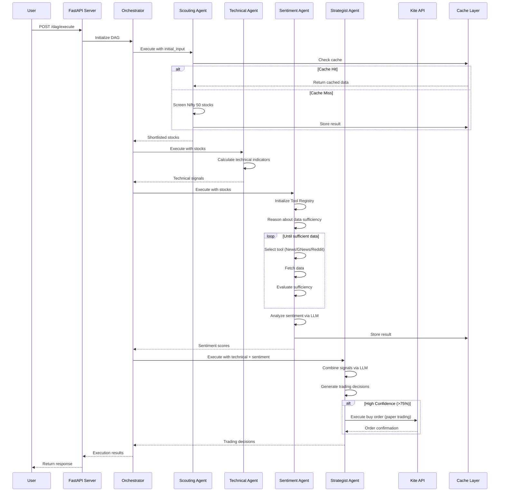

# AI Swing Trader - Multi-Agent Trading System

A sophisticated multi-agent trading system that uses AI agents to screen stocks, perform technical and sentiment analysis, and make automated trading decisions. The system follows an agentic architecture where specialized agents work together in a DAG (Directed Acyclic Graph) workflow to identify and execute trading opportunities.

## 🎯 Project Overview

This project implements a **multi-agent trading system** that:
- **Screens** stocks from Nifty 50 based on liquidity, volume, and volatility
- **Analyzes** stocks using technical indicators and sentiment from news/social media
- **Makes decisions** by combining multiple signals using LLM reasoning
- **Executes trades** automatically via Zerodha Kite API (paper trading mode)

## 🏗️ Architecture

### System Components

```
┌─────────────────────────────────────────────────────────────┐
│                    FastAPI Backend Server                   │
│  ┌──────────────────────────────────────────────────────┐   │
│  │              Orchestrator (DAG Engine)                │   │
│  │  - Manages agent execution order                      │   │
│  │  - Handles data flow between agents                   │   │
│  │  - Tracks execution state                             │   │
│  └──────────────────────────────────────────────────────┘   │
│                                                               │
│                    ┌──────────────┐                          │
│                    │   Scouting   │                          │
│                    │    Agent     │                          │
│                    └──────┬───────┘                          │
│                           │                                   │
│              ┌────────────┴────────────┐                     │
│              │                         │                     │
│              ▼                         ▼                     │
│      ┌──────────────┐         ┌──────────────┐              │
│      │  Technical   │         │  Sentiment   │              │
│      │    Agent     │         │    Agent     │              │
│      └──────┬───────┘         └──────┬───────┘              │
│             │                        │                       │
│             └────────────┬───────────┘                       │
│                          │                                   │
│                          ▼                                   │
│                  ┌──────────────┐                           │
│                  │  Strategist  │                           │
│                  │    Agent     │                           │
│                  └──────┬───────┘                           │
│                         │                                    │
│                         ▼                                    │
│                  ┌──────────────┐                           │
│                  │ Kite Client  │                           │
│                  │(Paper Trading)│                           │
│                  └──────────────┘                           │
└─────────────────────────────────────────────────────────────┘
```

### Key Design Principles

1. **Agentic Architecture**: Each agent is autonomous and can reason about data sufficiency
2. **DAG-Based Orchestration**: Agents execute in a defined workflow with dependencies
3. **Factory Pattern**: Agents are instantiated using factory functions for flexibility
4. **Caching**: Results are cached for 3 hours to avoid redundant computations
5. **Stateless Agents**: Agents are stateless and deterministic for reliability

## 🤖 Agents

### 1. **Scouting Agent** (`agents/scouting/`)
- **Purpose**: Screens Nifty 50 stocks and shortlists top candidates
- **Criteria**: Liquidity, volume, volatility (ATR)
- **Output**: Top N stocks (default: 10) with screening scores
- **Caching**: Results cached for 3 hours

**Key Functions:**
- Fetches Nifty 50 stock list
- Calculates screening metrics (volume, ATR, liquidity)
- Ranks and shortlists stocks

### 2. **Technical Agent** (`agents/technical/`)
- **Purpose**: Performs technical analysis on shortlisted stocks
- **Analysis**: RSI, MACD, Moving Averages, Support/Resistance
- **Input**: Stocks from Scouting Agent
- **Output**: Technical signals (buy/sell/hold) with confidence scores

**Key Functions:**
- Calculates technical indicators
- Identifies chart patterns
- Generates trading signals

### 3. **Sentiment Agent** (`agents/sentiment/`)
- **Purpose**: Analyzes market sentiment from news and social media
- **Data Sources**: 
  - Event Registry News API (primary)
  - GNews API (alternative)
  - Reddit (r/stocks, r/investing)
  - Twitter (WIP - currently redirects to Reddit)
- **Agentic Behavior**: 
  - Automatically expands search timeframe if news volume is low
  - Dynamically selects data sources based on sufficiency
  - Uses LLM (Groq/Qwen) for sentiment analysis
- **Input**: Stocks from Scouting Agent
- **Output**: Sentiment scores and confidence levels
- **Caching**: Results cached for 3 hours

**Key Features:**
- Tool Registry system for dynamic tool selection
- Adaptive data collection (2 days → 90 days → 180 days)
- Multi-source sentiment aggregation

### 4. **Strategist Agent** (`agents/strategist/`)
- **Purpose**: Makes final trading decisions by combining all signals
- **Input**: Technical analysis + Sentiment analysis
- **Decision Process**: 
  - Uses Groq LLM to reason about combined signals
  - Generates trading decisions (buy/sell/hold) with confidence
  - Executes trades if confidence > threshold (default: 75%)
- **Output**: Trading decisions with execution status
- **Trading**: Paper trading mode via Zerodha Kite API

**Key Functions:**
- Aggregates technical and sentiment signals
- LLM-based decision making
- Order execution (paper trading)

## 📊 Workflow

### Execution Flow



### Detailed Agent Workflow



## 🚀 Setup & Installation

### Prerequisites

- Python 3.8 or higher
- pip (Python package manager)
- API Keys (see Environment Variables section)

### Installation Steps

1. **Clone the repository** (if applicable)
   ```bash
   cd ai-swing-trader
   ```

2. **Navigate to backend directory**
   ```bash
   cd backend
   ```

3. **Create virtual environment** (recommended)
   ```bash
   python -m venv venv
   source venv/bin/activate  # On macOS/Linux
   # OR
   venv\Scripts\activate  # On Windows
   ```

4. **Install dependencies**
   ```bash
   pip install -r requirements.txt
   ```

5. **Set up environment variables**
   ```bash
   # Create .env file in backend directory
   touch .env
   ```
   
   Add the following to `.env`:
   ```env
   GROQ_API_KEY=your_groq_api_key_here
   NEWS_API_KEY=your_news_api_key_here
   NEWS_API_URL=https://eventregistry.org/api/v1/article/getArticles
   KITE_API_KEY=your_kite_api_key_here
   KITE_API_SECRET=your_kite_api_secret_here
   KITE_ACCESS_TOKEN=your_kite_access_token_here
   ```

6. **Run the backend server**
   ```bash
   python main.py
   # OR
   ./run.sh
   # OR
   uvicorn main:app --host 0.0.0.0 --port 8000 --reload
   ```

## 📡 API Endpoints

### Base URL
```
http://localhost:8000
```

### Available Endpoints

#### 1. Health Check
```http
GET /health
```
Returns server health status.

#### 2. Get DAG Information
```http
GET /dag/info
```
Returns the DAG configuration and structure.

#### 3. Execute DAG (Synchronous)
```http
POST /dag/execute
Content-Type: application/json

{
  "initial_input": {
    "top_n": 10
  }
}
```
Executes the entire DAG workflow synchronously.

#### 4. Execute DAG (Asynchronous)
```http
POST /dag/execute/async
Content-Type: application/json

{
  "initial_input": {
    "top_n": 10
  }
}
```
Executes the DAG workflow asynchronously and returns an execution ID.

#### 5. Get Execution History
```http
GET /executions
```
Returns list of all execution results.

#### 6. Get Specific Execution
```http
GET /executions/{execution_id}
```
Returns details of a specific execution.

#### 7. Get All Agents
```http
GET /agents
```
Returns list of all registered agents.

### Example API Call

Using `curl`:
```bash
curl -X POST http://localhost:8000/dag/execute \
  -H "Content-Type: application/json" \
  -d '{"initial_input": {"top_n": 10}}'
```

Using Python:
```python
import requests

response = requests.post(
    "http://localhost:8000/dag/execute",
    json={"initial_input": {"top_n": 10}}
)
print(response.json())
```

## 🔧 Configuration

### DAG Configuration
The DAG workflow is defined in `backend/orchestrator/dag.py`. You can modify:
- Agent execution order
- Input/output mappings between agents
- Agent-specific configurations

### Agent Configuration
Each agent can be configured via:
- Constructor parameters
- Factory function arguments
- Environment variables

### Caching
- **TTL**: 3 hours (configurable in `common/cache.py`)
- **Scope**: Per-agent results
- **Storage**: In-memory (resets on server restart)

## 🧪 Testing

### Manual Testing
```bash
# Start the server
cd backend
python main.py

# In another terminal, test the API
curl -X POST http://localhost:8000/dag/execute \
  -H "Content-Type: application/json" \
  -d '{"initial_input": {"top_n": 5}}'
```

### Interactive API Documentation
Once the server is running, visit:
- **Swagger UI**: http://localhost:8000/docs
- **ReDoc**: http://localhost:8000/redoc

## 📁 Project Structure

```
ai-swing-trader/
├── backend/
│   ├── agents/
│   │   ├── scouting/          # Stock screening agent
│   │   │   ├── agent.py
│   │   │   ├── data_provider.py
│   │   │   ├── schemas.py
│   │   │   └── tools.py
│   │   ├── technical/         # Technical analysis agent
│   │   │   ├── technical_agent.py
│   │   │   ├── technical_schemas.py
│   │   │   └── technical_tools.py
│   │   ├── sentiment/         # Sentiment analysis agent
│   │   │   ├── sentiment_agent.py
│   │   │   ├── sentiment_tools.py
│   │   │   ├── social_media_tools.py
│   │   │   ├── news_provider.py
│   │   │   └── agent_tools.py
│   │   └── strategist/         # Final decision agent
│   │       ├── agent.py
│   │       ├── kite_client.py
│   │       └── schemas.py
│   ├── common/                 # Shared utilities
│   │   ├── base_agent.py      # Base agent class
│   │   ├── cache.py           # Caching utility
│   │   └── logging_config.py
│   ├── orchestrator/           # DAG orchestration
│   │   ├── dag.py             # DAG configuration
│   │   ├── main.py            # Orchestrator logic
│   │   └── schemas.py
│   ├── main.py                # FastAPI entry point
│   ├── requirements.txt
│   ├── .env                   # Environment variables
│   └── README.md
├── frontend/                   # Frontend (if applicable)
└── README.md                   # This file
```

## 🔐 Environment Variables

Required environment variables (in `backend/.env`):

| Variable | Description | Required |
|----------|-------------|----------|
| `GROQ_API_KEY` | Groq API key for LLM inference | Yes |
| `NEWS_API_KEY` | Event Registry API key | Yes |
| `NEWS_API_URL` | Event Registry API endpoint | Yes |
| `KITE_API_KEY` | Zerodha Kite API key | Optional |
| `KITE_API_SECRET` | Zerodha Kite API secret | Optional |
| `KITE_ACCESS_TOKEN` | Zerodha Kite access token | Optional |

## 🎓 Key Features

### 1. Agentic Architecture
- Agents can reason about data sufficiency
- Dynamic tool selection based on context
- Adaptive behavior (e.g., expanding search timeframe)

### 2. Multi-Source Data Collection
- News APIs (Event Registry, GNews)
- Social media (Reddit, Twitter - WIP)
- Stock data (Yahoo Finance, mock data for development)

### 3. LLM-Powered Decision Making
- Groq API with Qwen3-32B model
- Sentiment analysis from unstructured text
- Trading decision reasoning

### 4. Caching System
- 3-hour TTL for agent results
- Reduces redundant API calls
- Improves response time

### 5. Paper Trading
- Safe testing environment
- Zerodha Kite API integration
- Simulated order execution

## 🚧 Future Enhancements

- [ ] Real Twitter API integration
- [ ] Fundamental analysis agent
- [ ] Real-time data streaming
- [ ] Database persistence for execution history
- [ ] WebSocket support for real-time updates
- [ ] Advanced risk management
- [ ] Portfolio optimization
- [ ] Backtesting framework
- [ ] Frontend dashboard

## 📝 Notes

- **Paper Trading**: Currently in paper trading mode. Modify `strategist/agent.py` to enable live trading.
- **Mock Data**: Scouting agent uses mock data for "RELIANCE.NS" for development. Replace with real API calls in production.
- **Caching**: Cache is in-memory and resets on server restart. Consider Redis for production.

## 🤝 Contributing

This is a personal project for learning and portfolio purposes. Feel free to fork and modify for your own use.

## 📄 License

This project is for educational and portfolio purposes.

---

**Built with**: Python, FastAPI, Groq API, Zerodha Kite API, Pydantic, and modern AI agentic patterns.
